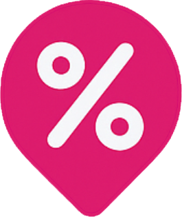

# Mapnefit

<div align="center">
  
  <br>

<b>mapnefit</b>

</div>

## 🧑‍🏫 프로젝트 소개

<div align="center">
<h2>통신사 멤버십 할인 정보를 한눈에 보여주는 위치 기반 서비스</h2>
</div>
통신사 혜택을 잘 몰라서 놓치는 사용자를 위해, 주변의 할인 매장을 빠르게 찾고
즐겨찾기로 나만의 혜택을 관리할 수 있습니다.


## Getting Started
```
npm install
npm run dev
```


## 주요 기능

1) 지도 기반 할인 매장 탐색
2) ai 챗봇 상담
3) 멤버십(쿠폰) 관리
4) 즐겨찾기 기반 개인 맞춤 서비스

## 기대 효과

- 복잡한 멤버십 혜택을 한 화면에서 비교 가능
- 위치 기반으로 근처의 혜택을 실시간 탐색
- 쿠폰 및 멤버십 등록을 통한 혜택 소비 효율 증가

<div align="center"><a href="https://mapnefit.vercel.app"><b>배포 링크</b></a></div>

## 🙋🏻‍♀️ Our Teams

<div align="center">
  <table>
    <tr>
      <td align="center">이승규</td>
      <td align="center">오다현</td>
    </tr>
    <tr>
      <td align="center"><a href="https://github.com/tmdrb0130">:link: Github</a></td>
      <td align="center"><a href="https://github.com/dahyuniiiiii">:link: Github</a></td>
    </tr>
  </table>
</div>

## 🧑‍💻 Tech Stacks

<div align="center">
<h3>[ Frontend ]</h3>


</div>

## 📁 프로젝트 구조

```
Frontend/
├── public/                                # 아이콘 이미지 등
│   ├── icon.png
│   ├── ...
├── src/
│   └── app/                               # Next.js App Router 루트
│       ├── (auth)/                        # 인증 관련 화면
│       │   ├── login/
│       │   │   └── page.tsx               # 로그인 페이지
│       │   ├── signup/
│       │   │   └── page.tsx               # 최초 회원가입 화면
│       │   └── layout.tsx                 # (auth) 전용 레이아웃
│       ├── api/                           # 서버 라우트(Edge/Node) – REST 엔드포인트
│       │   └── auth/
│       │       └── kakao/
│       │           ├── route.ts           # GET /api/auth/kakao → 카카오 인가 페이지로 리다이렉트
│       │           └── callback/
│       │               └── route.ts       # GET /api/auth/kakao/callback → 코드→토큰→프로필→세션 쿠키 설정
│       ├── favicon.ico
│       ├── globals.css                    # 앱 전역 스타일(Tailwind)
│       ├── layout.tsx                     # 앱 전역 레이아웃
│       └── page.tsx                       # 루트(/) 페이지
├── components/                            # 공용 UI 컴포넌트
├── lib/                                   # 유틸/클라이언트/서버 로직 등
├── .env.local                             # 로컬 환경변수(KAKAO_REST_API_KEY 등)
├── .gitignore
├── eslint.config.mjs
├── next-env.d.ts
├── next.config.ts
├── postcss.config.mjs
├── tsconfig.json
├── package.json
├── package-lock.json
└── README.md
```